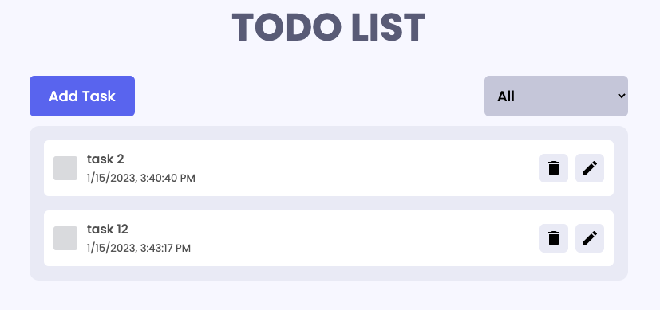

<p align="center">
    
</p>

<!-- [Preview](https://klam2k20.github.io/Calculator/) -->

## Overview

This is a responsive To-Do App created with ReactJS. The app has the fundamental CRUD functionalities to create, update and delete tasks.
It utilizes React-Redux to handle app state, Framer motion for simple animations, Hot Toast for informative toast messages, and local
storage to store tasks in between sessions.

## Getting Started

### Prerequisites

- npm
  ```sh
  npm install -g npm
  ```

### Installation

1. Clone the repo
   ```sh
   git clone https://github.com/klam2k20/To-Do.git
   ```
2. `cd` to project folder
3. Install yarn packages
   ```sh
   yarn install
   ```
4. Start React project
   ```sh
   yarn start
   ```
