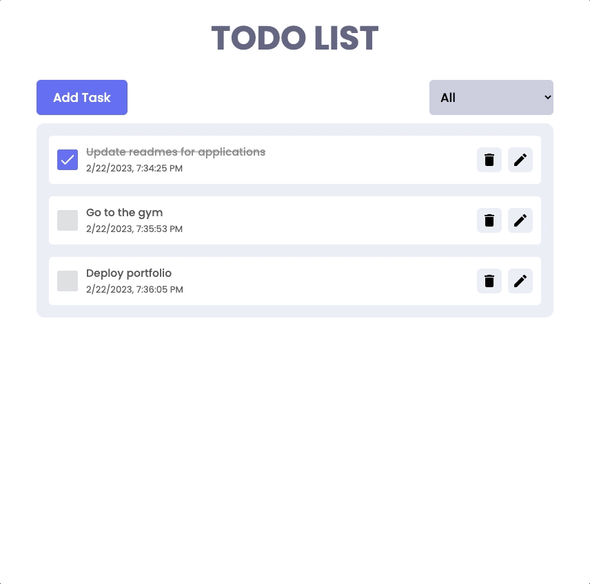
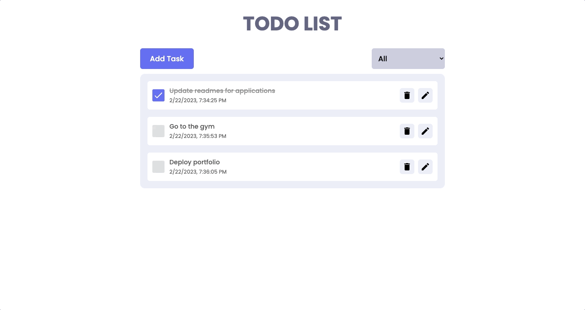
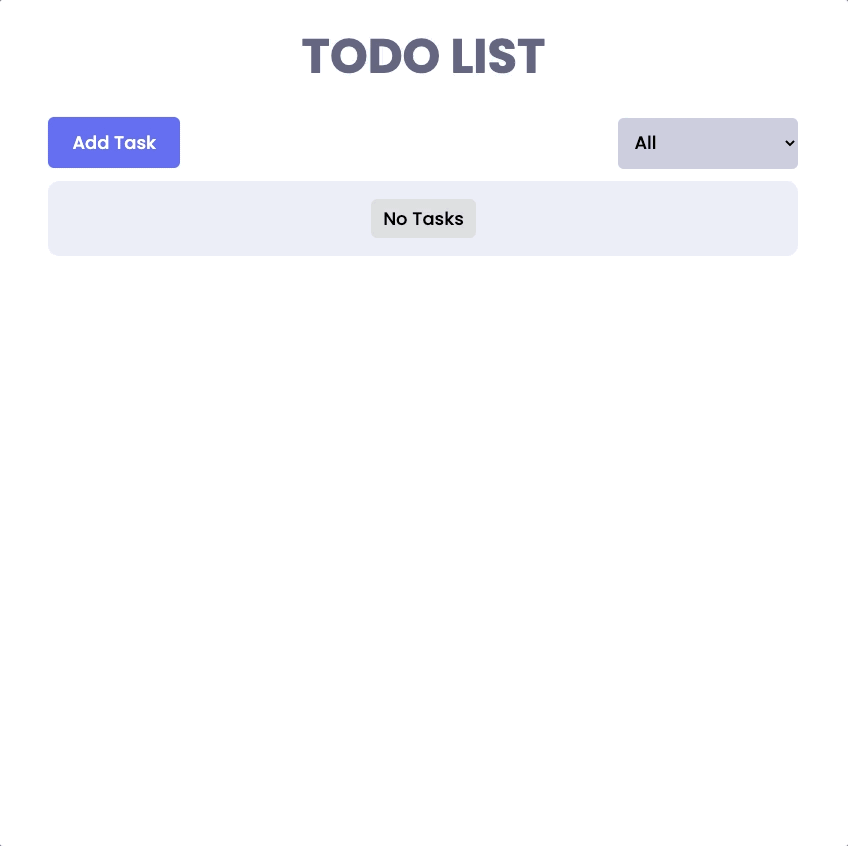
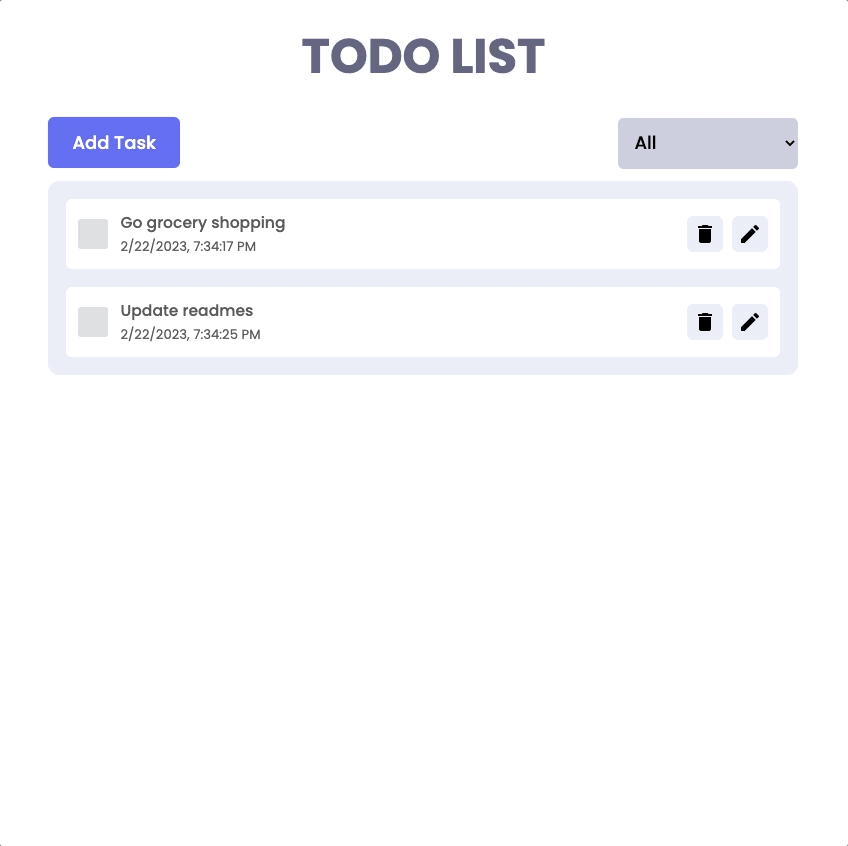
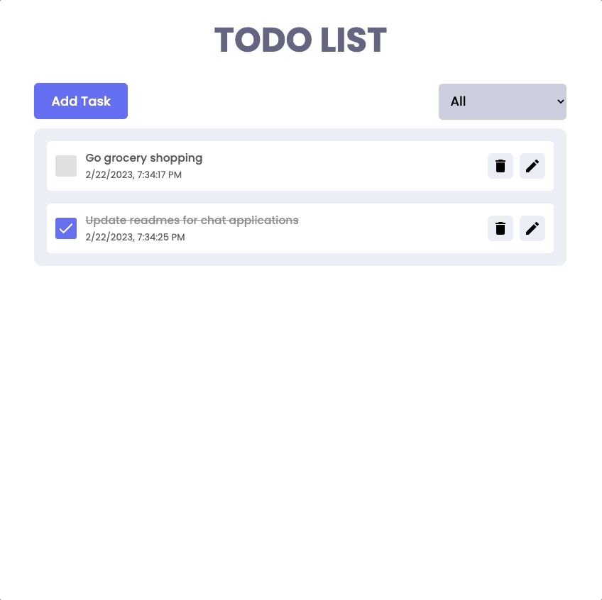

<p align="center">
    
</p>

## Overview

This is a responsive To-Do App. It has the fundamental CRUD functionalities to create, update and delete tasks.
It utilizes React-Redux to handle app state, Framer motion for simple animations, Hot Toast for informative
toast messages, and local storage to store tasks in between sessions.

## Technology

- 
- 
- 

## Features

- Responsive Design
<p align="center">
    
</p>

- Add Tasks
<p align="center">
    
</p>

- Update Tasks
<p align="center">
    
</p>

- Delete Tasks
<p align="center">
    
</p>

- Filter Tasks
<p align="center">
    
</p>

## Getting Started

### Prerequisites

- yarn/npm

### Installation

```sh
# Clone the repo
git clone https://github.com/klam2k20/To-Do.git

# cd to project folder
cd To-Do

# Install dependencies
yarn install

# Start the application
yarn start
```
